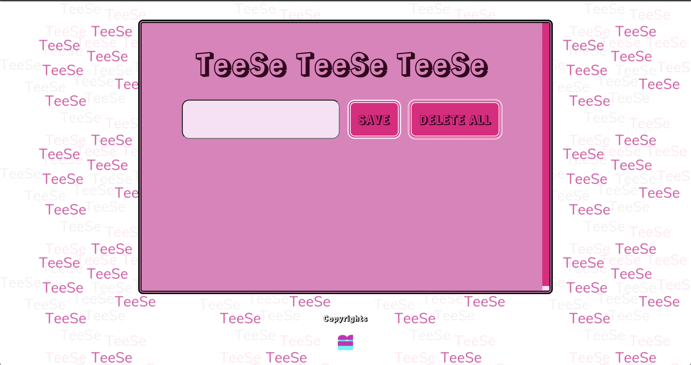
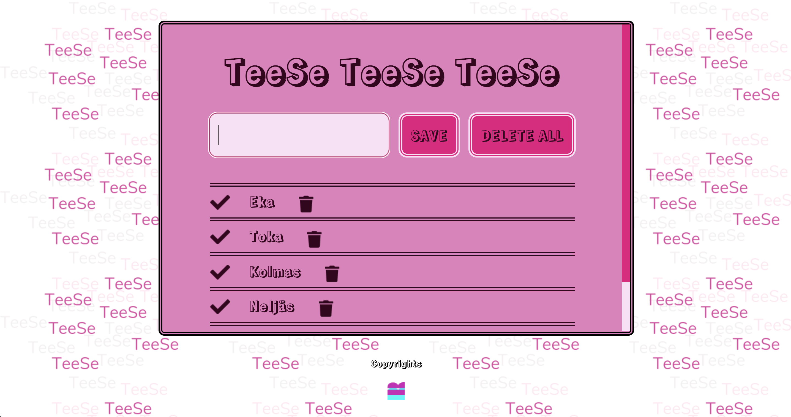

# toDo

Business College Helsinki school project with Typescript, HTML5, CSS3 and localstorage.
Refactored code from earlier To Do project. The point of this was to practice Typescript with familiar project by using previously writen code and converting it to Typescript.

To do list with delete, delete all and overline.
Page can be refreshed.

## Screenshots

